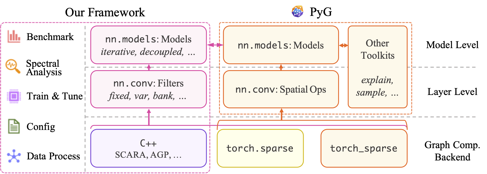

# Benchmarking Spectral Graph Neural Networks

`pyg_spectral` is a [PyTorch Geometric](https://pyg.org)-based framework for analyzing, implementing, and benchmarking spectral GNNs with effectiveness and efficiency evaluations.

> [!IMPORTANT]
> ***Why this project?***  
> We list the following highlights of our framework compared to PyG and similar works:
> - **Unified Framework**: We offer a plug-and-play collection for spectral models and filters in unified and efficient implementations, rather than a model-specific design. Our rich collection greatly extends the PyG model zoo.
> - **Spectral-oriented Design**: We decouple non-spectral designs and feature the pivotal spectral kernel being consistent throughout different settings. Most filters are thus easily adaptable to a wide range of model-level options, including those provided by PyG and PyG-based frameworks.
> - **High scalability**: As spectral GNNs are inherently suitable for large-scale learning, our framework is feasible to common scalable learning schemes and acceleration techniques. Several spectral-oriented approximation algorithms are also supported.

## Installation

This package can be easily installed by [pip](https://pip.pypa.io/en/stable/):
```bash
pip install -e .
```

The installation script already covers the following core dependencies:
- [PyTorch](https://github.com/pytorch/pytorch) (`>=2.0`): please follow the [official guide](https://pytorch.org/get-started/locally/) if a specific CUDA version is required.
- [PyTorch Geometric](https://github.com/pyg-team/pytorch_geometric) (`>=2.5.3`)
- [TorchMetrics](https://github.com/Lightning-AI/torchmetrics) (`>=1.0`): only required for `benchmark/` experiments.
- [Optuna](https://github.com/optuna/optuna) (`>=3.4`): only required for hyperparameter search in `benchmark/` experiments.

## Reproduce Experiments
### Main Experiments
Acquire results on the effectiveness and efficiency of spectral GNNs.
Datasets will be automatically downloaded and processed by the code.

#### Run full-batch models (*Table 2, 8, 9*):
```bash
cd benchmark
bash scripts/runfb.sh
```

#### Run mini-batch models (*Table 3, 10, 11*):
```bash
bash scripts/runmb.sh
```

### Additional Experiments
#### Effect of graph normalization vs degree-speficic accuracy (*Figure 3, 9*):
```bash
bash scripts/eval_degree.sh
```

Figures can be plotted by: `benchmark/notebook/fig_degng.ipynb`

#### Effect of the number of propagation hops vs accuracy (*Figure 7, 8*):
```bash
bash scripts/eval_hop.sh
```

Figures can be plotted by: `benchmark/notebook/fig_hop.ipynb`

#### Frequency response ():

## Customization
### Configure Experiment Parameters
Refer to the help text by:
```
python benchmark/run_single.py --help
```
```
usage: python benchmark/run_single.py
options:
    --help                      show this help message and exit
    # Logging configuration
    --seed SEED                 random seed
    --dev DEV                   GPU id
    --suffix SUFFIX             Save name suffix.
    -quiet                      Dry run without saving logs.
    --storage {state_file,state_ram,state_gpu}
                                Storage scheme for saving the checkpoints.
    --loglevel LOGLEVEL         10:progress, 15:train, 20:info, 25:result
    # Data configuration
    --data DATA                 Dataset name
    --data_split DATA_SPLIT     Index or percentage of dataset split
    --normg NORMG               Generalized graph norm
    --normf [NORMF]             Embedding norm dimension. 0: feat-wise, 1: node-wise, None: disable
    # Model configuration
    --model MODEL               Model class name
    --conv CONV                 Conv class name
    --num_hops NUM_HOPS         Number of conv hops
    --in_layers IN_LAYERS       Number of MLP layers before conv
    --out_layers OUT_LAYERS     Number of MLP layers after conv
    --hidden HIDDEN             Number of hidden width
    --dp_lin  DP_LIN            Dropout rate for linear
    --dp_conv DP_CONV           Dropout rate for conv
    # Training configuration
    --epoch EPOCH               Number of epochs
    --patience PATIENCE         Patience epoch for early stopping
    --period PERIOD             Periodic saving epoch interval
    --batch BATCH               Batch size
    --lr_lin  LR_LIN            Learning rate for linear
    --lr_conv LR_CONV           Learning rate for conv
    --wd_lin  WD_LIN            Weight decay for linear
    --wd_conv WD_CONV           Weight decay for conv
    # Model-specific
    --theta_scheme THETA_SCHEME Filter name
    --theta_param THETA_PARAM   Hyperparameter for filter
    --combine {sum,sum_weighted,cat}
                                How to combine different channels of convs
    # Conv-specific
    --alpha ALPHA               Decay factor
    --beta BETA                 Scaling factor
    # Test flags
    --test_deg                  Call TrnFullbatch.test_deg()
```

### Add New Experiment Dataset
In `benchmark/trainer/load_data.py`, append the `SingleGraphLoader._resolve_import()` method to include new datasets under respective protocols.

### Add New Spectral Filter
New spectral filters can be easily implemented by **only three steps**, then enjoys a range of model architectures, analysis utilities, and training schemes.

#### Step 1: Define propagation matrix
The base class `BaseMP`provides essential methods for building spectral filters. We can define a new filter class `SkipConv` by inheriting from it:
```python
from torch import Tensor
from pyg_spectral.nn.conv.base_mp import BaseMP

class SkipConv(BaseMP):
    def __init__(self, num_hops, hop, cached, **kwargs):
        kwargs['propagate_mat'] = 'A-I'
        super(SkipConv, self).__init__(num_hops, hop, cached, **kwargs)
```

The propagation matrix is specified by the `propagate_mat` argument as a string. Each matrix can be the normalized adjacency matrix (`A`) or the normalized Laplacian matrix (`L`), with optional diagonal scaling, where the scaling factor can either be a number or an attribute name of the class. Multiple propagation matrices can be combined by `,`. Examples: `A`, `L-alpha*I`, `L,A+I,L-2*I`.

#### Step 2: Prepare representation matrix
Similar to PyG modules, our spectral filter class takes the graph attribute `x` and edge index `edge_index` as input. The `_get_convolute_mat()` method prepares the representation matrices used in recurrent computation as a dictionary:
```python
def _get_convolute_mat(self, x, edge_index):
    return {'x': x, 'x_1': x}
```

The above example overwrites the method for `SkipConv`, returning the input feature `x` and a placeholder `x_1` for the representation in the previous hop.

#### Step 3: Derive recurrent forward
The shadow method `_forward()` implements the recurrent computation of the filter. Its input and output is a dictionary combining the propagation matrices defined by `propagate_mat` and the representation matrices prepared by `_get_convolute_mat()`. 
```python
def _forward(self, x, x_1, prop):
    if self.hop == 0:
        # No propagation for k=0
        return {'x': x, 'x_1': x, 'prop': prop}

    h = self.propagate(prop, x=x)
    h = h + x_1
    return {'x': h, 'x_1': x, 'prop': prop}
```

Similar to PyG modules, the `propagate()` method conducts graph propagation by the given matrices. The above example corresponds to a graph propagation with residual connection to the previous representation:
$$
H^{(k)} = (A-I)H^{(k-1)} + H^{(k-2)}.
$$

#### Build the model!
Now the `SkipConv` filter is properly defined. The following snippet use the `DecoupledVar` model composing 10 hops of `SkipConv` filters, which can be used as common PyTorch models:
```python
from pyg_spectral.nn.models import DecoupledVar

model = DecoupledVar(conv='SkipConv', num_hops=10, in_channels=x.size(1), hidden_channels=x.size(1), out_channels=x.size(1))
out = model(x, edge_index)
```

## Framework Arrangement

### Covered Models

| **Category** | **Model** |
|:------------:|:----------|
| Fixed Filter | [GCN](https://pytorch-geometric.readthedocs.io/en/latest/generated/torch_geometric.nn.conv.GCNConv.html), |

### Covered Datasets

| **Source** | **Graph** |
|:------------:|:----------|
| [PyG](https://pytorch-geometric.readthedocs.io/en/stable/modules/datasets.html) | cora, |
| [OGB](https://ogb.stanford.edu/docs/nodeprop/) |  |
| [LINKX](https://github.com/CUAI/Non-Homophily-Large-Scale) |  |
| [Yandex](https://github.com/yandex-research/heterophilous-graphs) |  |

### Code Structure

- `benchmark/`: codes for benchmark experiments.
- `pyg_spectral/`: core codes for spectral GNNs designs, arranged in [PyG](https://github.com/pyg-team/pytorch_geometric) structure.
  - `nn.conv`: spectral spectral filters, similar to [`torch_geometric.nn.conv`](https://pytorch-geometric.readthedocs.io/en/latest/modules/nn.html#convolutional-layers).
  - `nn.models`: common neural network architectures, similar to [`torch_geometric.nn.models`](https://pytorch-geometric.readthedocs.io/en/latest/modules/nn.html#models).
- `log/`: experiment log files and parameter search results.
- `data/`: raw and processed datasets arranged following different protocals.



## Roadmap
- [ ] Support C++ propagation backend with efficient algorithms.
- [ ] Support more transformation operations.
- [ ] Support iterative eigen-decomposition for full-spectrum spectral filters.

## Misc
- This project is licensed under the [MIT LICENSE](LICENSE).
- Please refer to the [CONTRIBUTING](docs/CONTRIBUTING.md) guide for contributing to this project.
- Use "Cite this repository" in the right sidebar for [CITATION](docs/CITATION.cff)
